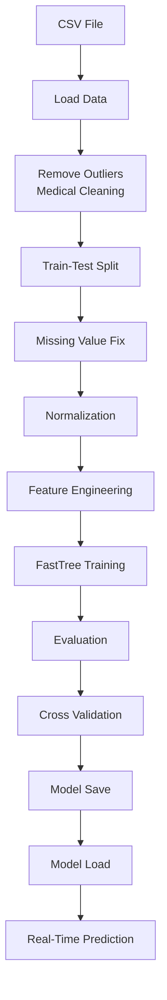

# ?? Cardio Disease Prediction using ML.NET (C#)

A  Machine Learning project built in C# using ML.NET** to predict the risk of cardiovascular disease based on patient medical data.  
This project includes **data preprocessing, training, evaluation, cross-validation, model persistence, and real-time prediction**.

---

## ?? Project Objective

The goal of this project is to:
- Predict whether a person has a **risk of cardiovascular disease**
- Based on medical attributes such as:
  - Age
  - Gender
  - Height
  - Weight
  - Blood Pressure (Systolic & Diastolic)
  - Cholesterol
  - Glucose
  - Smoking, Alcohol Intake, Physical Activity

---

## ?? Machine Learning Workflow
